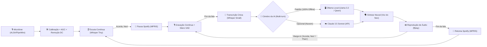

# 🕶️ Acorda, Neo

<p align="center">
  
</p>

<p align="center">
  <strong>Hands-free Linux Desktop AI Voice Assistant powered by Local Ollama (100% Offline / Free) & Claude</strong>
</p>

<p align="center">
  
  
  
  
  
  
  
  
  
</p>

---

## 📖 Visão Geral / Overview

**Acorda, Neo** é um assistente pessoal de voz para o desktop Linux construído para operar de forma **totalmente hands-free** (sem botões para apertar), com prioridade em **inteligência 100% local, offline e gratuita via [Ollama](https://ollama.com/)**, mantendo a **Claude (Anthropic)** como opção extra de alta capacidade.

Ele permanece em segundo plano ouvindo o ambiente com um modelo leve de baixo consumo. Ao escutar a frase de ativação **"Acorda, Neo"**, ele desperta, grava sua fala contínua, detecta automaticamente quando você termina de falar (via Silero VAD), consulta a IA (Ollama local ou Claude) e responde com voz neural realista inspirada no Neo do Matrix em português.

Todo o reconhecimento de áudio (STT) e a inteligência do modelo de linguagem (LLM) rodam **localmente na sua máquina** — privacidade total, sem custos de API e com funcionamento offline.

---

## 📸 Interface do Aplicativo

<p align="center">
  
</p>

---

## ⚡ Fluxo de Funcionamento



---

## ✨ Recursos Principais

- 🦙 **Inteligência 100% Local com Ollama (Padrão & Gratuito):**
  - Roda modelos locais como `llama3.2:3b`, `qwen3:8b`, `mistral`, `deepseek-r1` sem gastar créditos de API e sem depender de internet para pensar.
  - Auto-detecta os modelos já baixados na sua máquina com seletor dinâmico direto na interface.
- ☁️ **Opção Claude 3.5 Sonnet:** Alterne para a API oficial da Anthropic a qualquer momento com um clique.
- 🕶️ **Vozes Inspiradas no Neo (Matrix):**
  - **🕶️ Neo Dublado PT-BR:** Tom grave, calmo e cadenciado no estilo clássico da dublagem brasileira.
  - **🕶️ Neo Keanu Reeves:** Timbre introspectivo com o vocal fry característico do Keanu.
- 🟢 **Layout Visual Temático Estilo Matrix:**
  - Interface GTK3 cyberpunk com paleta dark phosphor green (`#00ff66`), cabeçalho estilo terminal, cartões neon e balões de diálogo com identificadores (`🧑 VOCÊ` e `🕶️ NEO`).
- 🖥️ **Integração Nativa com o Desktop Pop!_OS (COSMIC / GNOME):**
  - Ícone oficial do Neo integrado em alta resolução (16x16 até 512x512 + SVG), perfeitamente associado ao lançador, Dock, Alt-Tab e barra de janelas via `StartupWMClass`.
- 🎙️ **Ativação por Voz (Hands-Free):** Fale *"Acorda, Neo"* de qualquer lugar da sala. Sem atalhos manuais ou cliques necessários.
- ⚡ **Interrupção por Voz (Barge-in / Fala Interrompível):** Fale *"Acorda, Neo"* ou *"Pare"* a qualquer momento enquanto o assistente estiver respondendo para cortar o áudio instantaneamente e fazer uma nova pergunta sem precisar esperar.
- 🧠 **Memória Contextual Multi-turn:** Mantém o histórico das últimas trocas da conversa para diálogos encadeados naturais (ex.: *"Quem dirigiu Matrix?"* ➔ *"E quais outros filmes elas fizeram?"*). O contexto é preservado mesmo alternando entre Ollama e Claude, e pode ser reiniciado por voz (*"Limpar conversa"*) ou pelo botão de novo chat no cabeçalho.
- 🎵 **Controle de Mídia MPRIS (Pausa Automática do Spotify):** Pausa automaticamente o Spotify, reprodutores e navegadores assim que você chama *"Acorda, Neo"*, e retoma a reprodução apenas do que estava tocando assim que a conversa é finalizada. Também aceita comandos de voz diretos (*"Pausa a música"*, *"Próxima música"*, *"Que música está tocando?"*).
- 🔒 **Reconhecimento de Voz 100% Privativo (Local):** Processado localmente no processador via `faster-whisper`.
- 🎚️ **Tratamento de Áudio & AGC Digital:**
  - Remoção automática de bias analógico (DC offset) que costuma estragar o reconhecimento em laptops.
  - Normalização inteligente de ganho (AGC): fala baixa ou distante é amplificada sem ruídos.
  - Correção automática de ganho no ALSA para codecs sensíveis (ex.: Realtek ALC257).
- ⏱️ **VAD (Voice Activity Detection) em Tempo Real:** Detecta pausas naturais de silêncio e encerra a gravação automaticamente, unindo todo o áudio antes da transcrição para evitar palavras cortadas.
- 📌 **Bandeja do Sistema (System Tray):** Fica ativo ouvindo em segundo plano mesmo se a janela for fechada, com menu rápido de ações.
- 🔊 **Indicadores Sonoros (Chimes):** Beeps futuristas de confirmação ao acordar e ao concluir a fala para saber o status sem olhar pra tela.
- 💾 **Exportação em Markdown (.md):** Salve o histórico das conversas com um clique, pelo menu da bandeja ou por comando de voz.
- ⚙️ **Automação do Linux e Ações Locais:** Controle o volume do computador, abra aplicativos (navegador, terminal, arquivos, editor) e consulte hora, data e bateria com a voz.
- 📜 **Prompt de Sistema Customizável:** Personalize as instruções e o comportamento da IA diretamente na tela de preferências.

---

## 🧱 Stack Tecnológica

| Componente | Tecnologia | Papel no Projeto |
|---|---|---|
| **Interface Gráfica** | GTK3 (PyGObject) | Janela principal, histórico estilo chat e painel de preferências |
| **Cérebro Principal (Local)** | [Ollama](https://ollama.com/) (`llama3.2`, `qwen3`, etc.) | Processamento 100% offline, gratuito e sem telemetria |
| **Cérebro Secundário (Nuvem)** | Anthropic Claude API (`claude-sonnet-4-5`) | Respostas de alta complexidade quando conectado à internet |
| **Memória Conversacional** | Multi-turn Session Manager | Mantém contexto entre perguntas em ambos os provedores |
| **Controle de Mídia** | MPRIS D-Bus / `playerctl` | Pausa automática do Spotify ao conversar e comandos de áudio |
| **STT (Ativação)** | `faster-whisper` (`tiny`) | Detecção rápida da palavra-chave com baixíssimo uso de CPU |
| **STT (Pergunta)** | `faster-whisper` (`small`) | Transcrição de alta precisão em língua portuguesa |
| **VAD** | Silero VAD | Identificação precisa de presença de fala e cortes de silêncio |
| **TTS & Barge-in** | `edge-tts` / `ffplay` | Síntese neural calibrada do Neo com interrupção instantânea |
| **Áudio do Sistema** | `arecord` / `ffplay` | Gravação e reprodução direta com drivers ALSA/PipeWire |

---

## 🚀 Instalação e Execução

### 1. Pré-requisitos do Sistema
No Ubuntu, Debian, Pop!_OS ou distribuições derivadas:

```bash
sudo apt update
sudo apt install -y python3-gi gir1.2-gtk-3.0 alsa-utils ffmpeg
```

*(Opcional para modo offline)* Ter o [Ollama](https://ollama.com/) instalado:
```bash
curl -fsSL https://ollama.com/install.sh | sh
ollama pull llama3.2:3b
```

### 2. Clonar o Repositório

```bash
git clone git@github.com:wiskton/AcordaNeo.git
cd AcordaNeo
```

### 3. Rodar

Basta executar o script de inicialização:

```bash
./run.sh
```

> O script iniciará o serviço do Ollama automaticamente se necessário, criará o ambiente virtual `.venv` com as dependências do `requirements.txt` e iniciará o assistente.

---

## 🔑 Configuração

Como o Ollama é local e gratuito, o aplicativo **já começa funcionando imediatamente**, sem exigir nenhuma chave ou cartão de crédito.

Se você desejar usar a **Claude** ou alterar parâmetros:
1. Clique no ícone de engrenagem (⚙️) na barra de título.
2. Alterne o provedor para **Claude** e insira sua chave da API da Anthropic (`sk-ant-...`).
3. Escolha sua **Voz padrão**.
4. Clique em **Salvar**.

As configurações são salvas em `~/.config/acordaneo/config.json` com permissão restrita `0600`:

```json
{
  "provedor": "ollama",
  "ollama_host": "http://localhost:11434",
  "ollama_model": "llama3.2:3b",
  "anthropic_api_key": "",
  "voz": "neo"
}
```

---

## 🖥️ Criando o Atalho no Menu do Sistema

Para abrir o aplicativo pelo menu de programas do GNOME/KDE/Cosmic:

```bash
cp acordaneo.desktop ~/.local/share/applications/
update-desktop-database ~/.local/share/applications/
```

---

## 🗣️ Vozes Disponíveis (Exclusivas do Neo)

| Identificador | Nome de Exibição | Estilo / Idioma |
|---|---|---|
| `neo` | 🕶️ Neo (Matrix - Dublado PT-BR) | Calmo, grave e cadenciado (estilo dublagem clássica brasileira) |
| `neo-keanu` | 🕶️ Neo (Keanu Reeves - Original) | Tom introspectivo e vocal fry característico do Keanu Reeves |

---

## 🎵 Controle de Mídia & Spotify (MPRIS)

O **Acorda, Neo** integra-se diretamente com o barramento D-Bus do Linux (`org.mpris.MediaPlayer2`) e com o utilitário `playerctl` para gerenciar seus reprodutores de mídia (**Spotify**, VLC, navegadores, Amberol, etc.):

- **Pausa Automática ao Conversar:** Assim que você diz *"Acorda, Neo"*, o player ativo é pausado imediatamente, garantindo silêncio no ambiente para que o microfone capture sua pergunta com máxima fidelidade.
- **Retomada Inteligente:** Quando a resposta do Neo termina, a música volta a tocar automaticamente. Se o Spotify já estava pausado por você antes de falar, ele **não** é despausado indevidamente.
- **Comandos de Voz de Mídia:**
  - ⏸️ *"Acorda, Neo, pausa a música"* / *"Pausar Spotify"*
  - ▶️ *"Acorda, Neo, continua a música"* / *"Tocar música"*
  - ⏭️ *"Acorda, Neo, próxima música"* / *"Pula a música"*
  - ⏮️ *"Acorda, Neo, música anterior"* / *"Volta a música"*
  - ℹ️ *"Acorda, Neo, que música está tocando?"* (informa o título da faixa e artista)

---

## 🧠 Memória Contextual Multi-turn

O assistente possui memória de diálogo contextual contínua de até 20 mensagens (10 turnos completos):

- **Diálogos Encadeados:** Pergunte *"Quem dirigiu Matrix?"* e, em seguida, *"E quais outros filmes elas fizeram?"* — o Neo mantém o contexto entre as perguntas.
- **Persistência Entre Provedores:** A memória é compartilhada; você pode começar uma conversa no **Ollama (local)** e alternar para a **Claude (nuvem)** sem perder o contexto.
- **Como Limpar o Histórico:**
  - **Por Voz:** Diga *"Acorda, Neo, limpar conversa"* (ou *"limpar histórico"*, *"novo chat"*, *"esquecer conversa"*).
  - **Pela Interface:** Clique no botão com ícone de limpeza (`edit-clear-all-symbolic`) no cabeçalho da janela para iniciar uma nova conversa.

---

## ⚡ Interrupção por Voz em Tempo Real (Barge-in)

Não é necessário esperar o assistente terminar de falar respostas longas:
- Enquanto o Neo estiver falando, basta dizer **"Acorda, Neo"** (ou *"Pare"*, *"Para"*, *"Silêncio"*).
- O áudio é cortado **instantaneamente** e o microfone entra imediatamente em modo de escuta para capturar sua nova pergunta.

## 💾 Exportação da Conversa em Markdown

Você pode exportar a qualquer momento todo o histórico do chat em formato Markdown (`.md`):
- **Pela Interface:** Clique no botão de salvar (`document-save-symbolic`) no cabeçalho da janela e escolha onde salvar o arquivo.
- **Pela Bandeja:** Clique com o botão direito no ícone da bandeja e selecione *"Exportar Conversa (Markdown)..."*.
- **Por Voz:** Diga *"Acorda, Neo, exportar conversa"* (ou *"salvar conversa"*). O arquivo será salvo automaticamente na sua pasta `~/Documents`.

---

## ⚙️ Automação do Linux e Comandos de Sistema

O Neo interage nativamente com o sistema Linux para executar comandos instantaneamente sem latência de IA:

- 🔊 **Controle de Volume (PipeWire/PulseAudio via `wpctl` e `pactl`):**
  - *"Acorda, Neo, aumentar volume"* (+10%)
  - *"Acorda, Neo, diminuir volume"* (-10%)
  - *"Acorda, Neo, volume em 60"* (define para 60%)
  - *"Acorda, Neo, mutar áudio"* / *"Desmutar"*
  - *"Acorda, Neo, qual é o volume?"*
- 🚀 **Abertura Rápida de Aplicativos:**
  - *"Acorda, Neo, abrir navegador"* (Brave, Chrome, Firefox)
  - *"Acorda, Neo, abrir terminal"* (COSMIC Terminal, GNOME Terminal, etc.)
  - *"Acorda, Neo, abrir arquivos"* (Gerenciador de arquivos)
  - *"Acorda, Neo, abrir editor"* (Editor de texto / código)
  - *"Acorda, Neo, abrir configurações"*
- ⏱️ **Consultas Rápidas do Computador:**
  - *"Acorda, Neo, que horas são?"*
  - *"Acorda, Neo, qual a data de hoje?"*
  - *"Acorda, Neo, quanto de bateria?"* (informa % de carga e estado da bateria)

---

## 🔊 Efeitos e Indicadores Sonoros (Chimes)

- Som sutil e futurista sintetizado via PCM de baixa latência ao reconhecer a palavra de ativação *"Acorda, Neo"*, permitindo saber que o assistente acordou mesmo sem olhar para a tela.
- Chime discreto de confirmação ao encerrar a escuta da pergunta e iniciar o pensamento.
- Pode ser ativado ou desativado facilmente na tela de **Configurações**.

---

## 📜 Personalização do Prompt de Sistema

O painel de preferências inclui um editor multilinhas para o **Prompt de Sistema**:
- Permite personalizar as instruções de comportamento, tom de voz, brevidade e personalidade da IA.
- Aplicado automaticamente tanto no **Ollama local** quanto na **Claude**.
- Botão *"Restaurar Prompt Padrão"* para voltar à configuração original a qualquer momento.

---

## ⚡ Atalho Global de Teclado & Push-to-Talk (IPC Socket)

O **Acorda, Neo** conta com um servidor IPC via UNIX socket (`~/.config/acordaneo/acordaneo.sock`) imune às limitações de segurança do Wayland:

- **Ativação Instantânea:** Permite ativar o microfone de qualquer lugar sem dizer a palavra-chave.
- **Flags de Linha de Comando:**
  - `acordaneo --wake` (ou `./run.sh --wake`): Ativa a escuta imediata no assistente já em execução.
  - `acordaneo --toggle`: Alterna a visibilidade da janela (mostrar / ocultar).
  - `acordaneo --present`: Traz a janela do assistente para o primeiro plano.
- **Script de Instalação Automática:**
  ```bash
  # Registra o atalho Super+A no GNOME / Pop!_OS automaticamente:
  ./scripts/instalar_atalho.sh "<Super>a"
  ```
  O script também exibe as diretrizes para configurar em **KDE Plasma**, **Hyprland**, **Sway** e **i3**.

---

## ⬇️ Download de Modelos Ollama com Progresso na Interface

Você pode gerenciar e baixar novos modelos de IA diretamente na tela de preferências:
- Campo de texto para digitar o nome de qualquer modelo do registro Ollama (ex: `deepseek-r1:8b`, `llama3.2:1b`, `qwen2.5:7b`).
- Barra de progresso contínua em tempo real com indicador de status e porcentagem.
- Botão para cancelar o download em andamento.
- Assim que o download é concluído, a lista de modelos disponíveis é atualizada automaticamente.

---

## 🗣️ Síntese de Voz 100% Offline com Piper TTS

Para operação completamente isolada de internet, o Acorda, Neo suporta o **Piper TTS**:
- Motor neural local ultra-rápido baseado em ONNX runtime.
- Modelo neural em português brasileiro pré-instalado: `pt_BR-edresson-low`.
- Zero dependência de conexão de rede e baixíssima latência.
- Alternância simples nas preferências entre **Edge-TTS (Online)** e **Piper TTS (Offline)** com fallback automático caso a rede esteja indisponível.

---

## 🎯 Palavra de Ativação (Wake Word) Customizável

A palavra de ativação não está engessada em *"Acorda, Neo"*:
- É possível definir qualquer gatilho nas configurações (ex: *"Computador"*, *"Jarvis"*, *"Neo"*).
- O Whisper STT adapta dinamicamente seu vocabulário inicial (`initial_prompt`) para maximizar a precisão no gatilho escolhido.
- A interrupção de fala (barge-in) acompanha dinamicamente a palavra configurada.

---

## 📦 Empacotamento Linux

O projeto inclui receitas e scripts para diferentes formatos de distribuição no Linux:
- **Flatpak:** Manifest completo em [`packaging/flatpak/com.github.wiskton.AcordaNeo.yaml`](file:///home/willem/Documents/GitHub/acordaneo/packaging/flatpak/com.github.wiskton.AcordaNeo.yaml).
- **AppImage:** Script de build e AppRun em [`packaging/appimage/`](file:///home/willem/Documents/GitHub/acordaneo/packaging/appimage/).
- **Arch Linux / AUR:** PKGBUILD pronto para compilação e instalação em [`packaging/aur/PKGBUILD`](file:///home/willem/Documents/GitHub/acordaneo/packaging/aur/PKGBUILD).
- **Systemd User Service:** Unidade em [`packaging/systemd/acordaneo.service`](file:///home/willem/Documents/GitHub/acordaneo/packaging/systemd/acordaneo.service) para iniciar o assistente automaticamente em segundo plano com a sessão gráfica.

---

## 🗺️ Roadmap

- [x] Detecção contínua hands-free e normalização de áudio com VAD
- [x] Suporte a modelos locais via Ollama (100% offline e gratuito)
- [x] Vozes calibradas do Neo (Matrix PT-BR e Keanu Reeves)
- [x] Ícone na bandeja do sistema (System Tray / StatusNotifierItem)
- [x] Interrupção por voz em tempo real (Barge-in / Fala Interrompível)
- [x] Memória de contexto multi-turn na conversa
- [x] Controle de mídia MPRIS (pausar Spotify ao conversar)
- [x] Botão para limpar a conversa no cabeçalho e comando de voz
- [x] Indicadores sonoros (chimes de despertar e finalização)
- [x] Exportação de histórico de conversa em Markdown
- [x] Personalização de Prompt de Sistema nas preferências
- [x] Comandos de automação do sistema Linux (volume, apps, hora/data, bateria)
- [x] Atalho global no teclado (Push-to-Talk via IPC socket e script de atalho)
- [x] Download de novos modelos Ollama direto pela interface com barra de progresso
- [x] Síntese de voz local 100% offline via Piper TTS (modelo neural pt_BR)
- [x] Palavra de ativação (Wake Word) customizável e adaptável
- [x] Empacotamento Linux (Flatpak, AppImage, AUR, systemd)

Confira os detalhes completos no documento **[ROADMAP.md](ROADMAP.md)**.

---

## 🤝 Contribuições

Contribuições, sugestões e relatórios de bugs são muito bem-vindos! Sinta-se à vontade para abrir uma Issue ou enviar um Pull Request.

---

## 📜 Licença

Este projeto está licenciado sob a licença [MIT](LICENSE).
