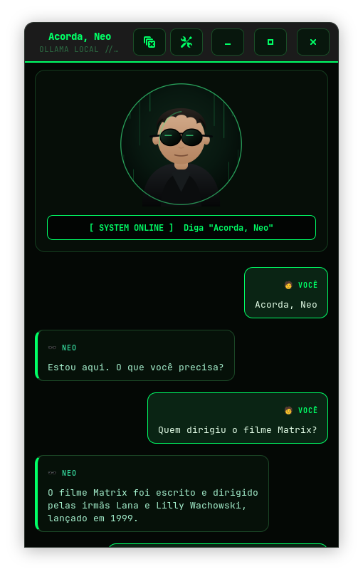
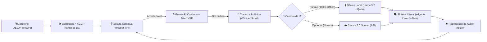

# 🕶️ Acorda, Neo

<p align="center">
  
</p>

<p align="center">
  <strong>Hands-free Linux Desktop AI Voice Assistant powered by Local Ollama (100% Offline / Free) & Claude</strong>
</p>

<p align="center">
  
  
  
  
  
  
  
  
</p>

---

## 📖 Visão Geral / Overview

**Acorda, Neo** é um assistente pessoal de voz para o desktop Linux construído para operar de forma **totalmente hands-free** (sem botões para apertar), com prioridade em **inteligência 100% local, offline e gratuita via [Ollama](https://ollama.com/)**, mantendo a **Claude (Anthropic)** como opção extra de alta capacidade.

Ele permanece em segundo plano ouvindo o ambiente com um modelo leve de baixo consumo. Ao escutar a frase de ativação **"Acorda, Neo"**, ele desperta, grava sua fala contínua, detecta automaticamente quando você termina de falar (via Silero VAD), consulta a IA (Ollama local ou Claude) e responde com voz neural realista inspirada no Neo do Matrix em português.

Todo o reconhecimento de áudio (STT) e a inteligência do modelo de linguagem (LLM) rodam **localmente na sua máquina** — privacidade total, sem custos de API e com funcionamento offline.

---

## 📸 Interface do Aplicativo

<p align="center">
  
</p>

---

## ⚡ Fluxo de Funcionamento



---

## ✨ Recursos Principais

- 🦙 **Inteligência 100% Local com Ollama (Padrão & Gratuito):**
  - Roda modelos locais como `llama3.2:3b`, `qwen3:8b`, `mistral`, `deepseek-r1` sem gastar créditos de API e sem depender de internet para pensar.
  - Auto-detecta os modelos já baixados na sua máquina com seletor dinâmico direto na interface.
- ☁️ **Opção Claude 3.5 Sonnet:** Alterne para a API oficial da Anthropic a qualquer momento com um clique.
- 🕶️ **Vozes Inspiradas no Neo (Matrix):**
  - **🕶️ Neo Dublado PT-BR:** Tom grave, calmo e cadenciado no estilo clássico da dublagem brasileira.
  - **🕶️ Neo Keanu Reeves:** Timbre introspectivo com o vocal fry característico do Keanu.
- 🟢 **Layout Visual Temático Estilo Matrix:**
  - Interface GTK3 cyberpunk com paleta dark phosphor green (`#00ff66`), cabeçalho estilo terminal, cartões neon e balões de diálogo com identificadores (`🧑 VOCÊ` e `🕶️ NEO`).
- 🖥️ **Integração Nativa com o Desktop Pop!_OS (COSMIC / GNOME):**
  - Ícone oficial do Neo integrado em alta resolução (16x16 até 512x512 + SVG), perfeitamente associado ao lançador, Dock, Alt-Tab e barra de janelas via `StartupWMClass`.
- 🎙️ **Ativação por Voz (Hands-Free):** Fale *"Acorda, Neo"* de qualquer lugar da sala. Sem atalhos manuais ou cliques necessários.
- ⚡ **Interrupção por Voz (Barge-in / Fala Interrompível):** Fale *"Acorda, Neo"* ou *"Pare"* a qualquer momento enquanto o assistente estiver respondendo para cortar o áudio instantaneamente e fazer uma nova pergunta sem precisar esperar.
- 🔒 **Reconhecimento de Voz 100% Privativo (Local):** Processado localmente no processador via `faster-whisper`.
- 🎚️ **Tratamento de Áudio & AGC Digital:**
  - Remoção automática de bias analógico (DC offset) que costuma estragar o reconhecimento em laptops.
  - Normalização inteligente de ganho (AGC): fala baixa ou distante é amplificada sem ruídos.
  - Correção automática de ganho no ALSA para codecs sensíveis (ex.: Realtek ALC257).
- ⏱️ **VAD (Voice Activity Detection) em Tempo Real:** Detecta pausas naturais de silêncio e encerra a gravação automaticamente, unindo todo o áudio antes da transcrição para evitar palavras cortadas.
- 📌 **Bandeja do Sistema (System Tray):** Fica ativo ouvindo em segundo plano mesmo se a janela for fechada, com menu rápido de ações.

---

## 🧱 Stack Tecnológica

| Componente | Tecnologia | Papel no Projeto |
|---|---|---|
| **Interface Gráfica** | GTK3 (PyGObject) | Janela principal, histórico estilo chat e painel de preferências |
| **Cérebro Principal (Local)** | [Ollama](https://ollama.com/) (`llama3.2`, `qwen3`, etc.) | Processamento 100% offline, gratuito e sem telemetria |
| **Cérebro Secundário (Nuvem)** | Anthropic Claude API (`claude-sonnet-4-5`) | Respostas de alta complexidade quando conectado à internet |
| **STT (Ativação)** | `faster-whisper` (`tiny`) | Detecção rápida da palavra-chave com baixíssimo uso de CPU |
| **STT (Pergunta)** | `faster-whisper` (`small`) | Transcrição de alta precisão em língua portuguesa |
| **VAD** | Silero VAD | Identificação precisa de presença de fala e cortes de silêncio |
| **TTS** | `edge-tts` | Síntese de voz neural calibrada para o tom do Neo |
| **Áudio do Sistema** | `arecord` / `ffplay` | Gravação e reprodução direta com drivers ALSA/PipeWire |

---

## 🚀 Instalação e Execução

### 1. Pré-requisitos do Sistema
No Ubuntu, Debian, Pop!_OS ou distribuições derivadas:

```bash
sudo apt update
sudo apt install -y python3-gi gir1.2-gtk-3.0 alsa-utils ffmpeg
```

*(Opcional para modo offline)* Ter o [Ollama](https://ollama.com/) instalado:
```bash
curl -fsSL https://ollama.com/install.sh | sh
ollama pull llama3.2:3b
```

### 2. Clonar o Repositório

```bash
git clone git@github.com:wiskton/AcordaNeo.git
cd AcordaNeo
```

### 3. Rodar

Basta executar o script de inicialização:

```bash
./run.sh
```

> O script iniciará o serviço do Ollama automaticamente se necessário, criará o ambiente virtual `.venv` com as dependências do `requirements.txt` e iniciará o assistente.

---

## 🔑 Configuração

Como o Ollama é local e gratuito, o aplicativo **já começa funcionando imediatamente**, sem exigir nenhuma chave ou cartão de crédito.

Se você desejar usar a **Claude** ou alterar parâmetros:
1. Clique no ícone de engrenagem (⚙️) na barra de título.
2. Alterne o provedor para **Claude** e insira sua chave da API da Anthropic (`sk-ant-...`).
3. Escolha sua **Voz padrão**.
4. Clique em **Salvar**.

As configurações são salvas em `~/.config/acordaneo/config.json` com permissão restrita `0600`:

```json
{
  "provedor": "ollama",
  "ollama_host": "http://localhost:11434",
  "ollama_model": "llama3.2:3b",
  "anthropic_api_key": "",
  "voz": "neo"
}
```

---

## 🖥️ Criando o Atalho no Menu do Sistema

Para abrir o aplicativo pelo menu de programas do GNOME/KDE/Cosmic:

```bash
cp acordaneo.desktop ~/.local/share/applications/
update-desktop-database ~/.local/share/applications/
```

---

## 🗣️ Vozes Disponíveis (Exclusivas do Neo)

| Identificador | Nome de Exibição | Estilo / Idioma |
|---|---|---|
| `neo` | 🕶️ Neo (Matrix - Dublado PT-BR) | Calmo, grave e cadenciado (estilo dublagem clássica brasileira) |
| `neo-keanu` | 🕶️ Neo (Keanu Reeves - Original) | Tom introspectivo e vocal fry característico do Keanu Reeves |

---

## 🗺️ Roadmap

- [x] Detecção contínua hands-free e normalização de áudio com VAD
- [x] Suporte a modelos locais via Ollama (100% offline e gratuito)
- [x] Vozes calibradas do Neo (Matrix PT-BR e Keanu Reeves)
- [x] Ícone na bandeja do sistema (System Tray / StatusNotifierItem)
- [ ] Indicadores sonoros (chimes de despertar e finalização)
- [ ] Atalho global no teclado (Push-to-Talk)
- [ ] Memória de contexto multi-turn na conversa
- [ ] Controle de mídia MPRIS (pausar Spotify ao conversar)

Confira os detalhes completos no documento **[ROADMAP.md](ROADMAP.md)**.

---

## 🤝 Contribuições

Contribuições, sugestões e relatórios de bugs são muito bem-vindos! Sinta-se à vontade para abrir uma Issue ou enviar um Pull Request.

---

## 📜 Licença

Este projeto está licenciado sob a licença [MIT](LICENSE).
