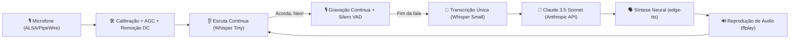

# 🕶️ Acorda, Neo

<p align="center">
  
</p>

<p align="center">
  <strong>Hands-free Linux Desktop AI Voice Assistant powered by Claude & Local Whisper STT</strong>
</p>

<p align="center">
  
  
  
  
  
  
  
</p>

---

## 📖 Visão Geral / Overview

**Acorda, Neo** é um assistente pessoal de voz para o desktop Linux construído para funcionar de forma **totalmente hands-free** (sem botões para apertar) e com foco em **privacidade**.

Ele permanece em segundo plano ouvindo o ambiente com um modelo ultraleve. Ao escutar a frase de ativação **"Acorda, Neo"**, ele desperta, grava sua fala contínua, detecta automaticamente quando você termina de falar, consulta a inteligência da **Claude (Anthropic)** e responde com voz neural realista em português (ou inglês).

Todo o reconhecimento de áudio é executado **100% localmente** na sua máquina via `faster-whisper` e `Silero VAD` — sua voz nunca é enviada para servidores externos.

---

## ⚡ Fluxo de Funcionamento



---

## ✨ Recursos Principais

- 🎙️ **Ativação por Voz (Hands-Free):** Fale *"Acorda, Neo"* de qualquer lugar da sala. Sem atalhos manuais ou cliques necessários.
- 🔒 **Reconhecimento de Voz 100% Privativo (Local):** Processado no próprio processador via `faster-whisper`.
- 🎚️ **Tratamento de Áudio & AGC Digital:**
  - Remoção automática de bias analógico (DC offset) que costuma estragar o reconhecimento em laptops.
  - Normalização inteligente de ganho (AGC): fala baixa ou à distância é amplificada sem ruídos.
  - Correção automática de ganho no ALSA para codecs Realtek (ALC257).
- ⏱️ **VAD (Voice Activity Detection) em Tempo Real:** Detecta pausas naturais de silêncio e encerra a gravação automaticamente, unindo todo o áudio antes da transcrição para evitar palavras cortadas.
- 🧠 **Respostas Inteligentes com a Claude:** Integração direta com a API oficial da Anthropic (`claude-sonnet-4-5`).
- 🗣️ **Vozes Neurais de Alta Qualidade:** Síntese fluida com `edge-tts` (diversas vozes masculinas e femininas em PT-BR, PT-PT e EN-US).
- 🖥️ **Interface Nativa GTK3:** Interface moderna, leve e responsiva com avatar, histórico de mensagens e janela de preferências.

---

## 🧱 Stack Tecnológica

| Componente | Tecnologia | Papel no Projeto |
|---|---|---|
| **Interface Gráfica** | GTK3 (PyGObject) | Janela principal, histórico estilo chat e painel de preferências |
| **Cérebro (LLM)** | Anthropic Claude API | Processamento de linguagem natural e geração de respostas |
| **STT (Ativação)** | `faster-whisper` (`tiny`) | Detecção rápida da palavra-chave com baixíssimo uso de CPU |
| **STT (Pergunta)** | `faster-whisper` (`small`) | Transcrição de alta precisão em língua portuguesa |
| **VAD** | Silero VAD | Identificação precisa de presença de fala e cortes de silêncio |
| **TTS** | `edge-tts` | Síntese de voz neural natural sem custo de API |
| **Áudio do Sistema** | `arecord` / `ffplay` | Gravação e reprodução direta com drivers ALSA/PipeWire |

---

## 🚀 Instalação e Execução

### 1. Pré-requisitos do Sistema
No Ubuntu, Debian, Pop!_OS ou distribuições derivadas:

```bash
sudo apt update
sudo apt install -y python3-gi gir1.2-gtk-3.0 alsa-utils ffmpeg
```

### 2. Clonar o Repositório

```bash
git clone git@github.com:wiskton/AcordaNeo.git
cd AcordaNeo
```

### 3. Rodar

Basta executar o script de inicialização:

```bash
./run.sh
```

> O script criará o ambiente virtual `.venv` automaticamente com suporte aos pacotes GTK do sistema, instalará as dependências do `requirements.txt` e iniciará o assistente.

---

## 🔑 Configuração

Na primeira inicialização, uma janela de preferências se abrirá:

1. Insira sua **Chave da API da Anthropic** (`sk-ant-...`), disponível no [Anthropic Console](https://console.anthropic.com).
2. Escolha sua **Voz padrão**.
3. Clique em **Salvar**.

As configurações são salvas em `~/.config/acordaneo/config.json` com permissão restrita `0600`:

```json
{
  "anthropic_api_key": "sk-ant-api03-...",
  "voz": "pt-BR-AntonioNeural",
  "modelo": "claude-sonnet-4-5"
}
```

---

## 🖥️ Criando o Atalho no Menu do Sistema

Para abrir o aplicativo pelo menu de programas do GNOME/KDE/Cosmic:

```bash
cp acordaneo.desktop ~/.local/share/applications/
update-desktop-database ~/.local/share/applications/
```

---

## 🗣️ Vozes Disponíveis

| Identificador | Nome de Exibição | Estilo / Idioma |
|---|---|---|
| `neo` | 🕶️ Neo (Matrix - Dublado PT-BR) | Calmo, grave e cadenciado (estilo dublagem) |
| `neo-keanu` | 🕶️ Neo (Keanu Reeves - Original) | Tom introspectivo, voz original Keanu Reeves |
| `pt-BR-AntonioNeural` | Antônio | Português (Brasil) - Masculino padrão |
| `pt-BR-FranciscaNeural` | Francisca | Português (Brasil) - Feminino |
| `pt-BR-ThalitaNeural` | Thalita | Português (Brasil) - Feminino |
| `pt-PT-DuarteNeural` | Duarte | Português (Portugal) - Masculino |
| `en-US-GuyNeural` | Guy | Inglês (EUA) - Masculino |
| `en-US-JennyNeural` | Jenny | Inglês (EUA) - Feminino |

---

## 🗺️ Roadmap

Planejamos novidades empolgantes para as próximas versões:
- [x] Detecção contínua e normalização de áudio com VAD
- [ ] Indicadores sonoros (chimes de despertar e finalização)
- [ ] Ícone na bandeja do sistema (System Tray)
- [ ] Atalho global no teclado (Push-to-Talk)
- [ ] Memória de contexto multi-turn na conversa
- [ ] Controle de mídia MPRIS (pausar Spotify ao conversar)
- [ ] Suporte a modelos locais via Ollama (100% offline)

Confira os detalhes completos no documento **[ROADMAP.md](ROADMAP.md)**.

---

## 🤝 Contribuições

Contribuições, sugestões e relatórios de bugs são muito bem-vindos! Sinta-se à vontade para:
1. Fazer um Fork do repositório
2. Criar uma branch com sua funcionalidade (`git checkout -b feature/minha-feature`)
3. Fazer o commit das alterações (`git commit -m 'feat: adiciona nova funcionalidade'`)
4. Enviar a branch (`git push origin feature/minha-feature`)
5. Abrir um Pull Request

---

## 📜 Licença

Este projeto está licenciado sob a licença [MIT](LICENSE).
